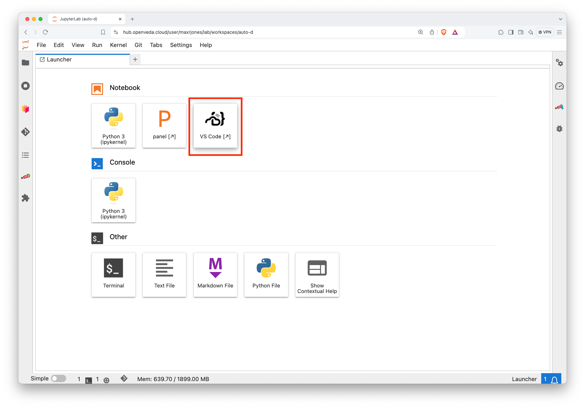
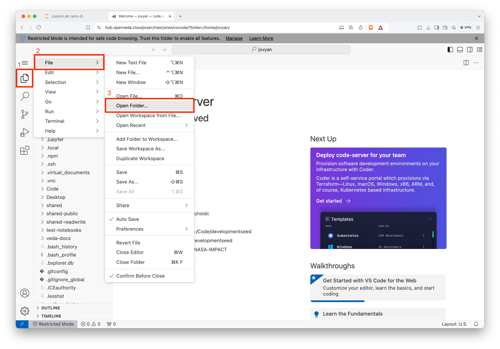
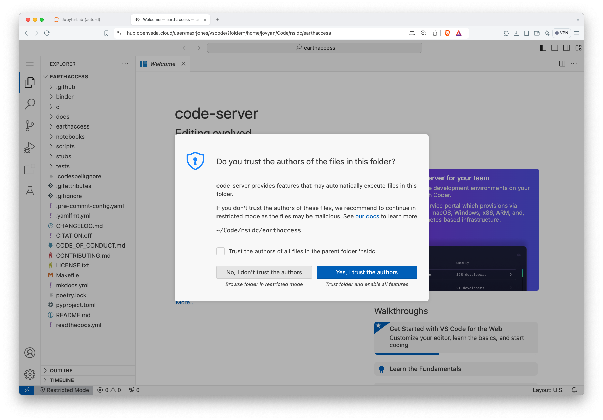
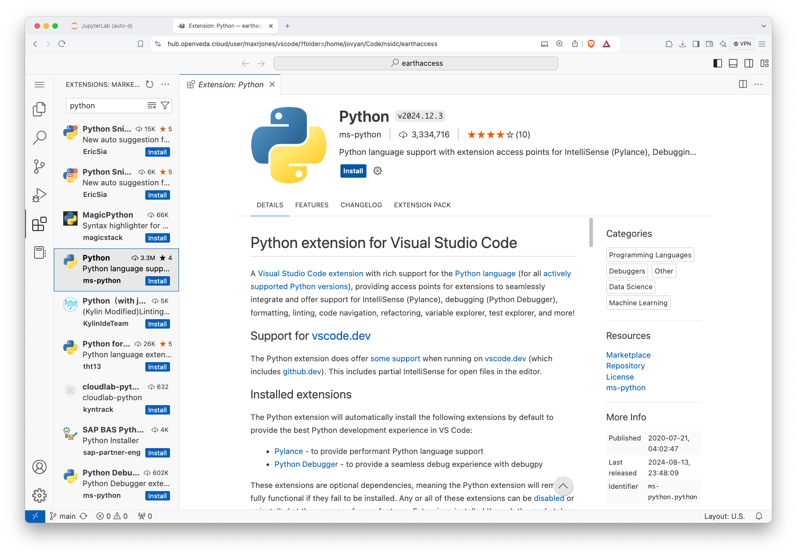
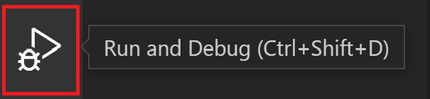
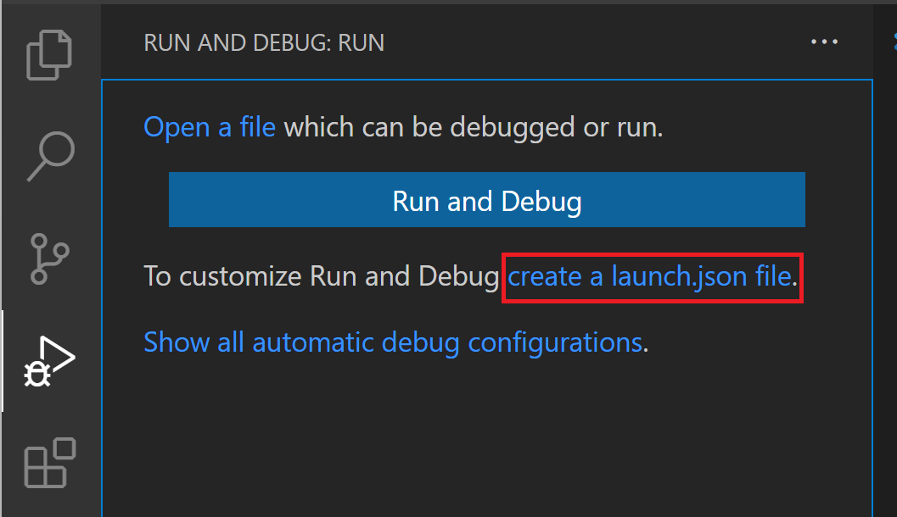
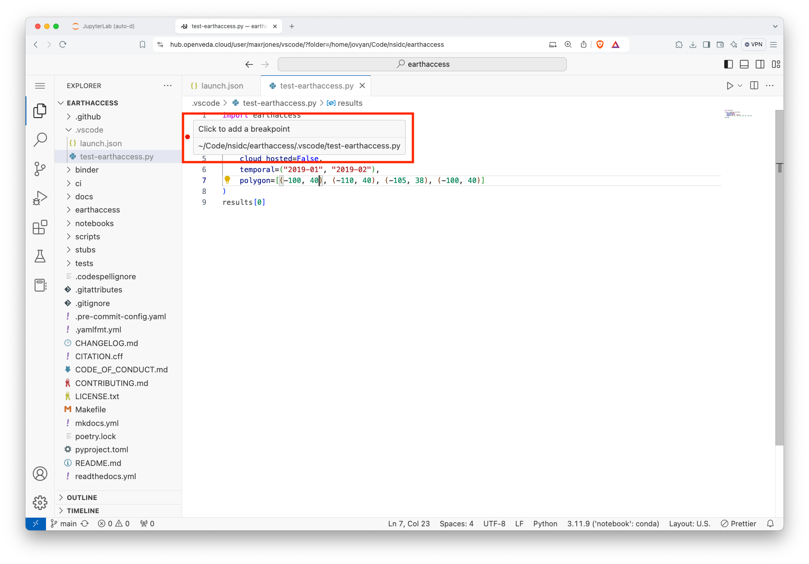
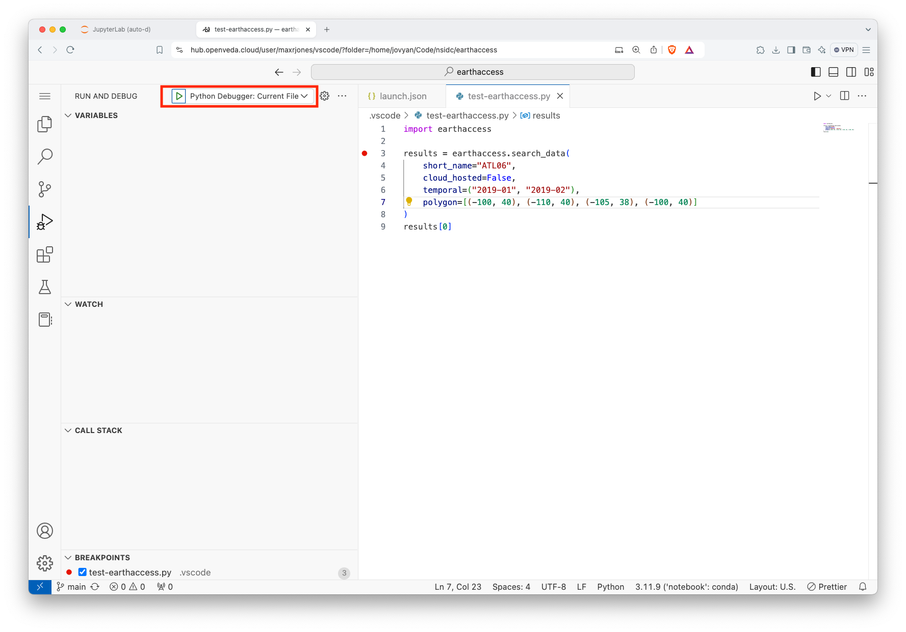

# How to use VS Code on the VEDA JupyterHub

This is a quick how-to guide for using VS Code as an IDE on the VEDA JupyterHub.

## Launch VSCode

1. Access the launcher from the home screen by clicking the `+` tab if it is not already open.
2. Click the "VS Code" icon on the top row. This will open a new browser tab with the VS Code interface:

   

3. Open the specific folder that you want to work in:

   - Click the three lines on the upper left (a.k.a., hamburger symbol)
   - Select 'File'
   - Select 'Open Folder...'
   - Navigate to the appropriate folder
   - Click 'OK'

   

4. Select that you trust the repository to enable all VS Code features:

   

Now, you have access to VS Code on the VEDA Hub and are ready to get started on your development!

:::{.callout-warning}
Using the full set of VS Code features requires trusting the folders, which should only be done for individual, known/trusted repositories rather than the entire JupyterHub home directory.
:::

:::{.callout-tip}
As an alternative to step 2, you can type the path to your folder after `?folder=` in the browser URL and press enter.
:::

:::{.callout-tip}
Most times, you will want to select a folder that is a git repository, perhaps cloned from GitHub, so that your code is version controlled.
:::

## Installing extensions

The VEDA JupyterHub comes with several VS Code extensions pre-installed. However, you may need access to others that are not installed. For example, the ms-python `Python` extension is required for debugging Python code and isn't curently installed by default.

1. Navigate to the Extensions view by clicking on the icon with four boxes and one slightly offset:

   {fig-align="left" width=100}

2. The view shows the already installed extensions. Type the name of the extension you're looking for in the 'Search Extensions' text box:

   

3. Click install.

:::{.callout-note}
The extensions will be installed for the duration of your session. For persistant access to VS Code extensions, raise an issue in [VEDA Hub docker image repository](https://github.com/NASA-IMPACT/pangeo-notebook-veda-image).
:::

## Debugging Python code

### Set up Python debugger configuration

1. Select the **Run** view in the sidebar:

{width=500 fig-align="left"}

2. Click on "create a launch.json file":

{width=500 fig-align="left"}

3. Select "Python Debugger".
4. Select "Python File: Debug the currently active Python file".

:::{.callout-note}
Check out the [Visual Studio Code Debugging docs](https://code.visualstudio.com/docs/python/debugging#_set-configuration-options) for additional configuration options. One of the more useful controls is setting `"justMyCode": false` to debug imported libraries.
:::

### Debug Python code

1. Open the Python file that you want to debug
2. Click to the left of a line number to add a breakpoint

3. From the **Run** view, click on the green triangle to start debugging

4. Use the debugger controls to continue, restart, stop, step over, step in, or step out of functions.

:::{.callout-tip}
Add the .vscode folder to your .gitignore and put ephemeral testing modules in their for debugging without poluting the git workspace.
:::

## Acknowledgments

Several images in this section are from [Microsoft's public documentation for Visual Studio Code](https://github.com/microsoft/vscode-docs). Images are used under the terms of the under the Creative Commons Attribution 3.0 United States License.
