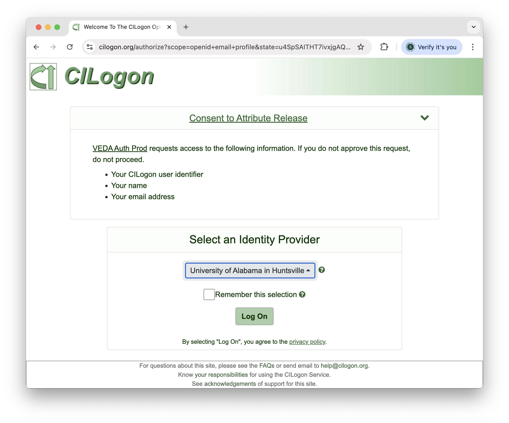
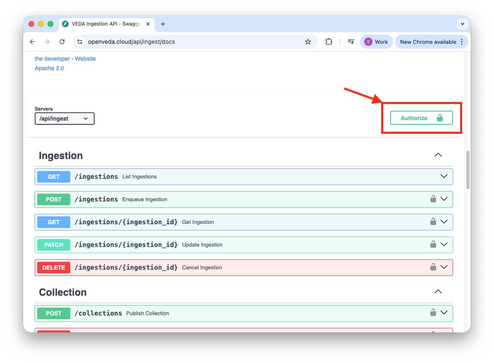
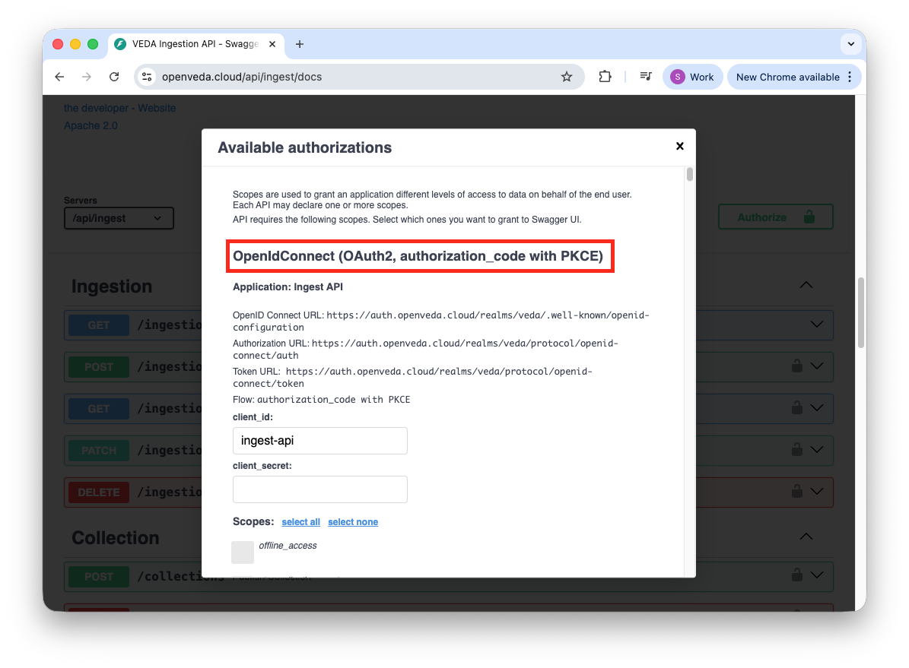
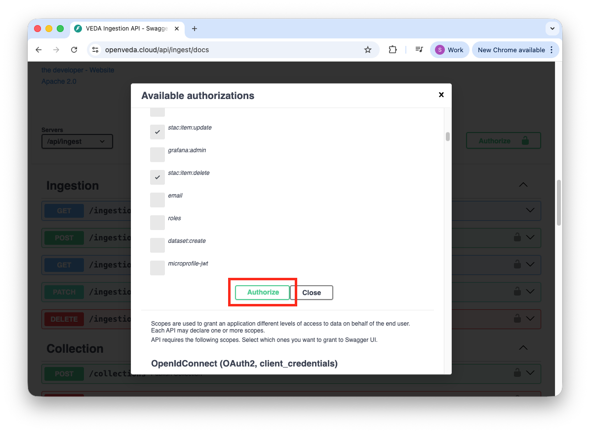

VEDA uses [Keycloak](https://www.keycloak.org/) as its identity and access management system across all services. Rather than maintaining separate credentials for each tool, Keycloak provides a single authentication layer that integrates with [CILogon](https://www.cilogon.org/home), allowing you to log in using your existing institutional or organizational identity provider.

The following VEDA services are protected by Keycloak:

- **Ingest API** — programmatic interface for dataset ingestion
- **STAC API** — programmatic interface for dataset ingestion
- **Ingest UI** — web interface for creating and managing ingestion workflows
- **SM2A** — Self Managed Apache Airflow
- **JupyterHub** — cloud-based computing environment
- **Grafana** — monitoring and observability dashboards

When you log in to any of these services, you are redirected to CILogon to select your identity provider. Keycloak automatically pulls your user information (username, email, first name, last name) from CILogon to create your account.

## Account Creation and Permissions

Keycloak accounts are created automatically the first time you log in to any VEDA service. The process works as follows:

1. Navigate to any VEDA service (e.g., Ingest UI, JupyterHub)
2. You will be redirected to the CILogon page - select your identity provider (we recommend using your work or institutional email)
3. Complete authentication with your identity provider
4. Keycloak automatically creates your account by pulling your username, email, first name, and last name from CILogon

::: {.callout-warning title="New accounts have no permissions by default"}
When your account is first created, you will **not** have permissions to perform any actions in any VEDA service. Your account exists but is essentially inactive until an administrator grants you access by adding you to the appropriate Keycloak group.

After your first login, contact the VEDA Data Services team via the **#veda-data-services** Slack channel or email [veda@uah.edu](mailto:veda@uah.edu) to request access to the services you need.
:::

::: {.callout-note title="Always use the same identity provider"}
Once you have been added to a Keycloak group, you must continue logging in with the **same CILogon identity provider** you used when your account was created. Switching to a different identity provider will create a separate account that does not have the permissions assigned to your original account.
:::

::: {.callout-tip title="Same login flow across all services"}
The login flow is identical across all VEDA services: you are redirected to CILogon, select your identity provider, and authenticate. The only difference is the specific URL you start from. If you have already logged in to one service, the steps for any other service will feel familiar.
:::

## Service-Specific Login Instructions

### Ingest API

The Ingest API uses OAuth 2.0 with PKCE for authentication through its Swagger documentation interface.

1. Go to [openveda.cloud/api/ingest/docs](https://openveda.cloud/api/ingest/docs)
2. Click the **"Authorize"** button

3. Scroll to the top of the authorization dialog and find the **"PKCE"** authorization section

4. Click **"Authorize"** within the PKCE section

5. Select your identity provider and complete authentication in the CILogon page.
6. Navigate back to the Ingest API docs page and select the **Authorize** button within the PKCE section.

