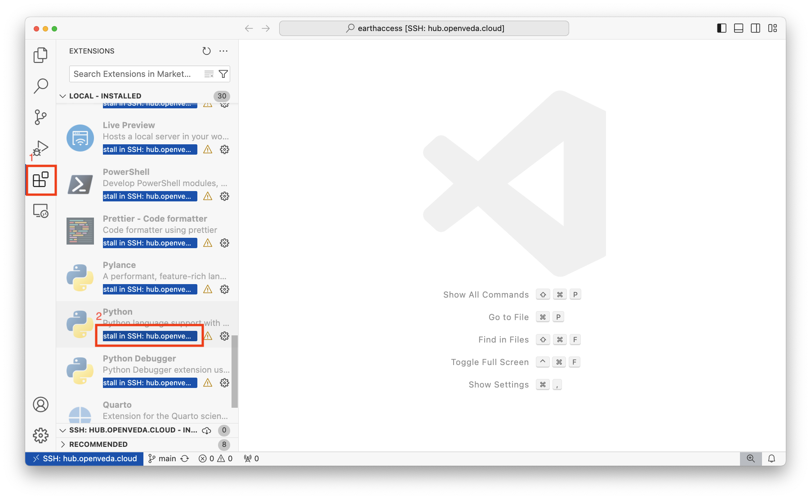
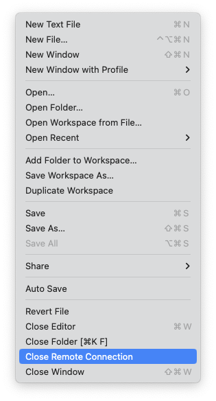

# How to ssh into the VEDA JupyterHub

This is a how-to guide for connecting to the VEDA JupyterHub from your local environment via `ssh`. This allows you to use all of `ssh`'s features (copy, run commands) as well as connecting via [VS Code's proprietary Remote Development functionality](https://code.visualstudio.com/docs/remote/ssh).

:::{.callout-note}
`websocat` must be installed on your local machine in order to remotely connect to the VEDA JupyterHub. The full installation instructions are available on [`websocat`'s GitHub README](https://github.com/vi/websocat#installation). websocat can be installed on macOS via `Homebrew` as `brew install websocat`.
:::

:::{.callout-warning}
We are exploring two options for using VS Code on the VEDA JupyterHub. These options should be considered experimental and may not be supported long-term.
:::

## Setup

### Get the token

1. Launch a server from the [VEDA JupyterHub home page](https://hub.openveda.cloud/). The server must be started in order to connect remotely.
2. Get a new token from the [VEDA JupyterHub token page](https://hub.openveda.cloud/hub/token):

   - Enter a descriptive name in the 'Note' text window.
   - Enter an expiration date.
   - Click "request a new API token"

   

:::{.callout-warning}
Treat this token like you would treat a password to your JupyterHub instance!
:::

### Setup your local `~/.ssh/config`

Before your first time remotely connecting to the VEDA JupyterHub, you need to configure your local ssh.

1. Add an entry that looks like the following to the end of your ~/.ssh/config. Create it if it does not exist.

   ```bash
   Host hub.openveda.cloud
       User jovyan
       ProxyCommand websocat --binary -H='Authorization: token <YOUR-JUPYTERHUB-TOKEN>' asyncstdio: wss://%h/user/<YOUR-JUPYTERHUB-USERNAME>/sshd/
   ```

2. Replace `<YOUR-JUPYTERHUB-TOKEN>` with the token you created earlier.
3. Replace `<YOUR-JUPYTERHUB-USERNAME>` with your VEDA JupyterHub username.

### Setup ssh keys on your JupyterHub server

You need to put some ssh public keys in `~/.ssh/authorized_keys` after you start your JupyterHub server and have completed the [setup of your private keys on your local machine](#setup-your-local-.sshconfig).

1. Launch a server from the [VEDA JupyterHub home page](https://hub.openveda.cloud/) if you don't already have one running.
2. Open a terminal in JupyterLab
3. Run the following commands, replacing <YOUR-GITHUB-USERNAME> with your github username:

   ```bash
   mkdir -p ~/.ssh
   wget https://github.com/<YOUR-GITHUB-USERNAME>.keys -O ~/.ssh/authorized_keys
   chmod 0600 ~/.ssh/authorized_keys
   ```

## Connect to JupyterHub

There are two ways to connect to JupyterHub: [Connect to the JupyterHub using VS Code's Remote SSH feature](#connect-to-the-jupyterhub-using-the-vs-code-remote-ssh-feature) and [Connect via ssh on the command line](#connect-to-the-jupyterhub-via-ssh-on-the-command-line).

### Connect to the JupyterHub using the VS Code Remote SSH feature

1. Launch a server from the [VEDA JupyterHub home page](https://hub.openveda.cloud/) if you don't already have one running.
2. Open a new VS Code Window on your local maachine.
3. Open the command prompt (command + shift + P on macOS)
4. Enter `Remote-SSH: Connect to Host...`
5. Select `hub.openveda.cloud`
6. Select "Open Folder" and select the specific folder that you want to work in.

Now you're connected and ready to develop using VS Code! You may need to [install some extensions in the SSH server](#install-extensions) to use your regular development workflows.

:::{.callout-tip}
Most times, you will want to select a folder that is a git repository, perhaps cloned from GitHub, so that your code is version controlled.
:::

:::{.callout-note}
If you have not ssh'd into the JupyterHub before, you will receive a notice that "The authenticity of host 'hub.openveda.cloud' can't be established.". Enter 'yes' in response to this prompt. This will add the key to your list of known hosts, so that you will be notified if it changes in the future.
:::

#### Install extensions

You will need to install the extensions that you want to use in the SSH.

1. Navigate to the Extensions view by clicking on the icon with four boxes and one slightly offset:

   {fig-align="left" width=100}

2. The view shows the already installed extensions. Type the name of the extension you're looking for in the 'Search Extensions' text box, or scroll to see your locally installed extensions:

   

3. Select 'Install in SSH: hub.openveda.cloud'

#### Closing the connection

1. Select **File > Close Remote Connection** to disconnect from the JupyterHub:

   {fig-align="left" width=250}

Exiting VS Code will also close the remote connection.

### Connect to the JupyterHub via ssh on the command line

1. Launch a server from the [VEDA JupyterHub home page](https://hub.openveda.cloud/) if you don't already have one running.
2. Open a new terminal on your local machine.
3. Enter `ssh hub.openveda.cloud`

You are now ssh'd into the JupyterHub! If you enter a command (e.g., `touch am-i-on-the-jupyterhub`), it will be run on the remote server.

:::{.callout-note}
If you have not ssh'd into the JupyterHub before, you will receive a notice that "The authenticity of host 'hub.openveda.cloud' can't be established.". Enter 'yes' in response to this prompt. This will add the key to your list of known hosts, so that you will be notified if it changes in the future.
:::

## Acknowledgments

These instructions are based off the [jupyter-sshd-proxy documentation](https://github.com/yuvipanda/jupyter-sshd-proxy/blob/main/README.md) and a screen recording Yuvi Panda shared in the NASA IMPACT slack workspace. Thank you to Yuvi Panda for developing `jupyter-sshd-proxy`!
